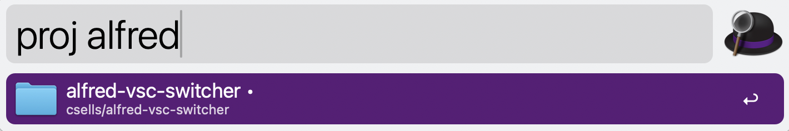

# alfred-vsc-proj-switcher

An [Alfred](https://www.alfredapp.com/) workflow for switching among VS Code
projects: type `proj` plus a few characters of a project name, press ⏎, and
you're in that project's window — **focused if it's already open, launched if
it isn't**.



## Why it works

No window enumeration is needed. VS Code's own CLI refuses to open a folder
that's already open in another window and focuses that window instead — a
documented, by-design behavior ([microsoft/vscode#35207](https://github.com/microsoft/vscode/issues/35207)).
So the workflow simply walks a projects root (`~/Code` by default) — any
folder containing a `.git` is a project (and isn't descended into), other
folders are grouping containers to recurse through, and plain depth-2 folders
(`<org>/<project>`) count as projects too — and hands the selected path to
`code`.
That makes it strictly more capable than a running-windows switcher: it reaches
every project, running or not, with no AppleScript, no native binaries, and no
Screen Recording or Accessibility permissions.

`research.md` has the verified deep-dive behind this design: the prior-art
survey (no existing Alfred workflow lists running VS Code windows), the
focus-reuse behavior, Script Filter mechanics, and the Electron/AppleScript
dead ends to avoid.

## Usage

- `proj <query>` — fuzzy-filter your projects; matches project and org names
  and any word within them (`trading` finds `auto-trading`), and Alfred's
  frecency learns your favorites. Projects with an open VS Code window show a
  • indicator
- ⇥ — autocomplete the selected project name
- ⏎ — open or focus the project in VS Code
- ⌘⏎ — force a new window
- ⌥⏎ — reveal the folder in Finder

## Install

Download the `.alfredworkflow` from the
[latest release](https://github.com/csells/alfred-vsc-proj-switcher/releases/latest)
and double-click it, or build from source:

```sh
./build.sh
open dist/proj.alfredworkflow   # Alfred prompts to import
```

### Requirements

- Alfred with the [Powerpack](https://www.alfredapp.com/powerpack/)
- VS Code (stable, Insiders, or VSCodium — the CLI is auto-detected across
  PATH, `/usr/local/bin`, Homebrew, and app bundles; set the workflow's
  "VS Code CLI" configuration field to pin a specific one)
- `python3` — macOS's bundled build is fine; on a fresh Mac the first run may
  prompt to install the Xcode Command Line Tools

### Configuration

In the workflow's Configure sheet: **Projects Root** (default `~/Code`) is
the folder to scan, and **VS Code CLI** (default auto-detect) pins the editor
when several are installed.

## Layout

- `src/` — workflow source (`info.plist`, scripts, icon); the
  `.alfredworkflow` in `dist/` is just a zip of this directory
- `specs/vision/` — what this is and why it's built this way
- `specs/plans/` — the implementation plan
- `research.md` — the research findings the design rests on

The • running indicator comes from `code --status`, which lists every open
window with no permissions required. Because `--status` takes ~1.5s, the
running set is cached and refreshed in the background; Alfred's `rerun`
mechanism updates the indicators in place a moment after you invoke `proj`.
Customizing VS Code's `window.title` setting hides the indicator (title
parsing depends on the default title ending in the workspace root name) but
breaks nothing else.

## Roadmap

- Recents from VS Code's `state.vscdb` for workspaces outside the projects root
- Alfred Gallery listing (submission drafted in `docs/gallery-submission.md`)
